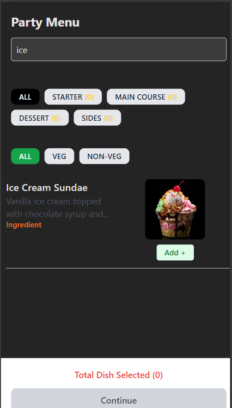

# Party Menu App 🎉

A delightful React application for browsing and selecting dishes for your next party! This app allows users to view a menu, filter dishes by type (e.g., starter, main course), dietary preference (vegetarian/non-vegetarian), and search for specific dishes. You can also view detailed information about each dish, including its ingredients.

## 🚀 Features

*   **Browse Dishes:** View a comprehensive menu of available dishes.
*   **Filter by Meal Type:** Easily filter dishes by categories such as "STARTER", "MAIN COURSE", "DESSERT", and "SIDES".
*   **Vegetarian/Non-Vegetarian Filter:** Filter dishes based on dietary preferences.
*   **Search Functionality:** Quickly find dishes by name using the search bar.
*   **Dish Details:** View detailed information about each dish, including its ingredients.
*   **Selection Management:** Select dishes for your party menu.
*   **Responsive Design:** Enjoy a seamless experience on various devices.

## 🛠️ Tech Stack

*   **Frontend:**
    *   React: JavaScript library for building user interfaces.
    *   React Router DOM: For handling routing and navigation.
    *   Tailwind CSS: For styling the application.
*   **Build Tool:**
    *   Vite: A fast build tool for modern web applications.
*   **Data:**
    *   JSON: Used to store dish data (`src/data/dishes.json`).

## 📦 Getting Started

Follow these instructions to get the project up and running on your local machine.

### Prerequisites

*   Node.js (version 18 or higher)
*   npm or yarn package manager

### Installation

1.  Clone the repository:

    ```bash
    git clone <repository_url>
    cd party-menu-app
    ```

2.  Install dependencies:

    ```bash
    npm install
    # or
    yarn install
    ```

### Running Locally

1.  Start the development server:

    ```bash
    npm run dev
    # or
    yarn dev
    ```

2.  Open your browser and navigate to `http://localhost:5173` (or the port Vite indicates).

## 💻 Project Structure

```
party-menu-app/
├── src/
│   ├── components/
│   │   ├── DishCard.jsx       # Component for displaying a dish card
│   │   ├── Filters.jsx        # Component for filtering by meal type
│   │   ├── SearchBar.jsx      # Component for the search bar
│   │   ├── VegFilter.jsx      # Component for filtering by vegetarian/non-vegetarian
│   │   └── ...
│   ├── data/
│   │   └── dishes.json      # JSON file containing dish data
│   ├── pages/
│   │   ├── IngredientPage.jsx # Page for displaying ingredient details
│   │   ├── MenuPage.jsx       # Main menu page
│   │   └── ...
│   ├── App.jsx            # Main application component (routing)
│   ├── main.jsx           # Entry point for the React application
│   ├── index.css          # Global CSS stylesheet
│   └── ...
├── vite.config.js       # Vite configuration file
├── package.json         # Project metadata and dependencies
├── README.md            # This file
└── ...
```

## 📸 Screenshots




## 🤝 Contributing

Contributions are welcome! Please follow these steps:

1.  Fork the repository.
2.  Create a new branch for your feature or bug fix.
3.  Make your changes and commit them with descriptive messages.
4.  Push your changes to your fork.
5.  Submit a pull request.


## 📬 Contact

If you have any questions or suggestions, feel free to contact me at [daveeddaveedd@gmail.com](mailto:daveeddaveedd@gmail.com).

## 💖 Thanks

Thank you for checking out the Party Menu App! I hope it helps you plan your next gathering.
